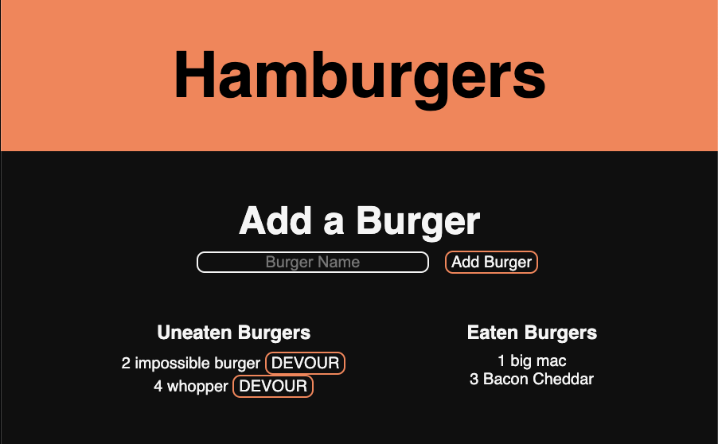

# Full Stack Hamburger

The hamburger web app allows users to add hamburgers to the uneaten list, and then "devour" hamburgers to move them to the eaten list.

Utilizing a mysql database, express server, and handlebars, the app exemplifies CRUD operations and full stack deployment.

## Usage

Visit the deployed application [here](https://rocky-woodland-85750.herokuapp.com/).

## Installation

- Head over to the [hamburger repository](https://github.com/roccomaniscalco/hamburger)
- Press the green _code_ button and select method of download
- Create a mysql database using `./db/schema.sql`
- Configure `./config/connection.js` to connect to your mysql database
- Run `npm i` in the root to install dependencies
- Run `npm start` to host the application on your local host

## NPM Packages

- mysql 
- express
- express-handlebars

## License

Licensed under the [MIT](https://opensource.org/licenses/MIT) license.
